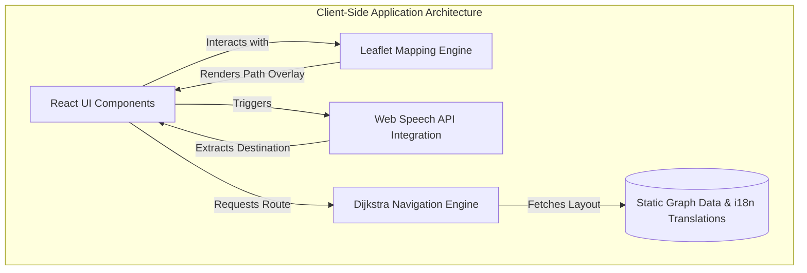
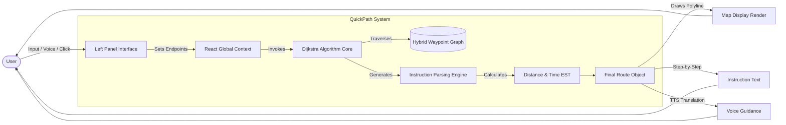
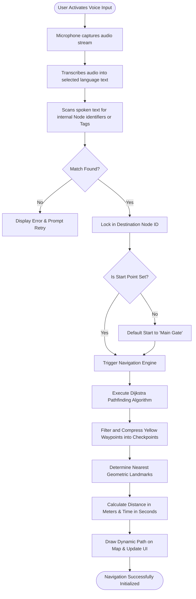

# QuickPath: Research Paper Diagrams

The following diagrams visually map out the structure and logic of the QuickPath application. You can copy these Mermaid code blocks directly into tools like Notion, GitHub, or Mermaid Live Editor (https://mermaid.live) to automatically render them as high-quality PNGs for your paper.

---

### 1. High-Level Architecture Diagram
This diagram illustrates the structural components of the QuickPath application, representing how the frontend engine operates primarily on the client side without relying on backend servers.

---

### 2. System Data Flow Diagram
This details how data cascades through the system when a user initiates a navigation request—from interaction, through the state management, to the mathematical engine, and finally back to the visual renderer.

---

### 3. Execution Flow Diagram (Voice & Routing Logic)
This flowchart explicitly breaks down the step-by-step logical sequence the application takes when a user triggers the hands-free voice navigation feature.

